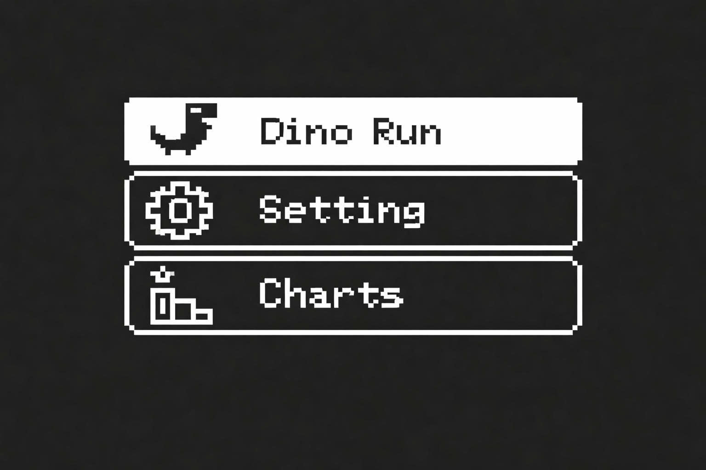
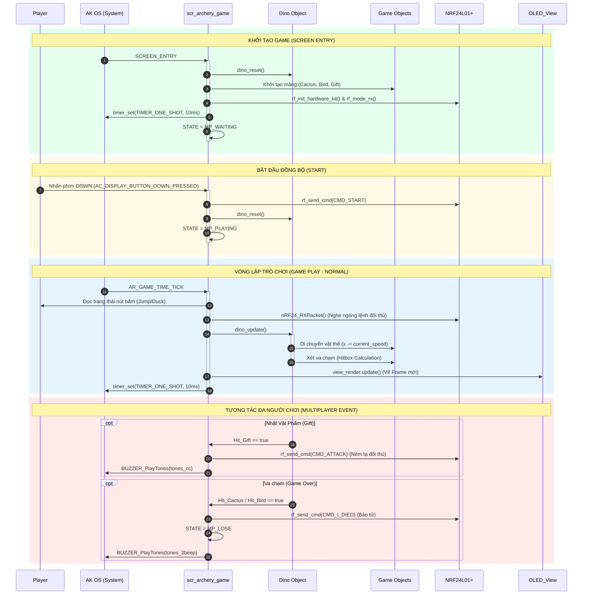

# Multiplayer Dino Game - Build on AK Embedded Base Kit


<hr>

## I. Giới thiệu

Multiplayer Dino game là một tựa game chạy trên AK Embedded Base Kit. Được xây dựng nhằm mục đích giúp các bạn có đam mê về lập trình nhúng có thể tìm hiểu và thực hành về lập trình event-driven. Trong quá trình xây dựng nên Dino game, các bạn sẽ hiểu thêm về cách thiết kế và ứng dụng UML, Task, Signal, Timer, Message, State-machine và đặc biệt là giao tiếp vô tuyến (RF).

### 1.1 Phần cứng

<p align="center"></p>
<p align="center"><strong><em>Hình 1:</em></strong> AK Embedded Base Kit - STM32L151</p>

[AK Embedded Base Kit](https://epcb.vn/products/ak-embedded-base-kit-lap-trinh-nhung-vi-dieu-khien-mcu) là một evaluation kit dành cho các bạn học phần mềm nhúng nâng cao.

KIT tích hợp LCD **OLED 1.3", 3 nút nhấn, và 1 loa Buzzer phát nhạc**, với các trang bị này thì đã đủ để học hệ thống event-driven thông qua thực hành thiết kế máy chơi game.

KIT cũng tích hợp **RS485**, **NRF24L01+**, và **Flash** lên đến 32MB, thích hợp cho prototype các ứng dụng thực tế trong hệ thống nhúng hay sử dụng như: truyền thông có dây, không dây wireless, các ứng dụng lưu trữ data logger,... Trong dự án này, module **NRF24L01+** được khai thác tối đa để làm tính năng Multiplayer (Nhiều người chơi) theo thời gian thực.

### 1.2 Mô tả trò chơi và đối tượng
Phần mô tả sau đây về **“Multiplayer Dino game”** , giải thích cách chơi và cơ chế xử lý của trò chơi.

<p align="center"></p>
<p align="center"><strong><em>Hình 2:</em></strong> Màn hình game play và các đối tượng</p>

#### 1.2.1 Các đối tượng (Object) trong game:
|Đối tượng|Tên đối tượng|Mô tả|
|---|---|---|
|**Khủng long**|Dino|Nhân vật chính. Có thể điều khiển nhảy lên hoặc gập người cúi xuống.|
|**Xương rồng**|Cactus|Chướng ngại vật nằm sát mặt đất. Bắt buộc phải nhảy qua.|
|**Chim dực long**|Bird|Chướng ngại vật bay trên không ở 2 tầm (cao và thấp). Ép người chơi phải nhảy hoặc cúi.|
|**Hộp quà**|Gift|Vật phẩm (Item) rơi ngẫu nhiên. Khi ăn được sẽ dùng để tấn công đối thủ qua sóng RF.|
|**Đám mây**|Cloud|Cảnh nền lơ lửng, trôi chậm hơn tiền cảnh để tạo hiệu ứng 3D (Parallax).|

#### 1.2.2 Cách chơi game:
- Trò chơi sử dụng 2 thiết bị kết nối với nhau. Một thiết bị được phân quyền làm `MASTER`. Nhấn nút **[Down]** trên máy Master để bắt đầu đồng bộ ván chơi cho cả 2 thiết bị.
- Trong trò chơi này bạn sẽ điều khiển Dino, nhấn nút **[Up]** để bật nhảy, và nhấn giữ nút **[Down]** để gập người cúi xuống.
- Mục tiêu trò chơi là kiếm được càng nhiều điểm càng tốt, sống sót lâu nhất có thể và ăn Hộp quà để gây khó dễ cho máy đối thủ. Trò chơi kết thúc khi Dino chạm vào Cactus hoặc Bird.

#### 1.2.3 Cơ chế hoạt động:
- **Cách tính điểm:** Điểm được tính bằng số lượng Cactus hoặc Bird mà bạn đã vượt qua thành công (mỗi đối tượng +1 điểm). Nếu mạo hiểm nhảy ăn được Gift, bạn sẽ được thưởng nóng +5 điểm.
- **Độ khó:** Tốc độ di chuyển ban đầu (Speed) là 35. Mỗi khi tích lũy được 15 điểm, tốc độ của game sẽ tăng lên một cấp độ (+5 đơn vị) và giới hạn ở mức 60 để tránh vật cản bị xuyên thấu.
- **Cơ chế Multiplayer (Tấn công):** Khi một thiết bị ăn được Gift, thiết bị đó lập tức phát sóng RF lệnh `CMD_ATTACK` sang máy còn lại. Máy bị tấn công sẽ báo động bằng còi, nhấp nháy chữ "SPEED UP!", và tốc độ game sẽ tăng đột biến (+20 đơn vị) trong vòng 3 giây.
- **Kết thúc trò chơi:** Khi Dino chạm vào vật cản, nó sẽ gửi lệnh `CMD_I_DIED` sang máy đối thủ. Máy chạm vật cản hiển thị "YOU LOSE", máy còn lại sẽ nhận được thông báo tử trận và hiển thị "YOU WIN". Nút **[Down]** được sử dụng để đưa game về trạng thái chờ (Waiting) cho ván mới.

## II. Thiết kế - MULTIPLAYER DINO GAME
**Các khái niệm trong event-driven:**

- **Event Driven:** Hệ thống gửi message để thực thi các công việc. Trong đó, Task đóng vai trò là người nhận thư, Signal đại diện cho nội dung công việc.
- **Task:** Mỗi Task sẽ nhận một nhóm công việc nhất định.
- **Message:** Được chia làm 2 loại chính, Message chỉ chứa Signal, hoặc vừa chứa Signal và Data.
- **Handler:** Chỗ thực thi một công việc nào đó.

### 2.1 Sơ đồ trình tự
**Sơ đồ trình tự** được sử dụng để mô tả trình tự của các Message và luồng tương tác giữa các đối tượng.



### Ghi chú:
**SCREEN_ENTRY:** Cài đặt các thiết lập ban đầu cho đối tượng trong game.
- **dino_reset():** Đặt tọa độ, vận tốc và trạng thái mặc định cho Dino. Khởi tạo mảng vật thể Tiền cảnh và Hậu cảnh. Đặt điểm số về 0.
- **rf_init_hardware_kit():** Khởi tạo ngoại vi vô tuyến NRF24L01+.
- **rf_mode_rx():** Chuyển NRF24L01+ sang chế độ lắng nghe (Receive Mode).
- **Setup timer - Time tick:** Khởi tạo `TIMER_ONE_SHOT` với chu kỳ 10ms (Sử dụng One-Shot để ngăn lỗi tràn bộ nhớ MF 31).

**GAME PLAY:** Quá trình hoạt động của game.

**GAME PLAY - Normal:** Game hoạt động ở trạng thái bình thường.
- **AR_GAME_TIME_TICK:** Signal do Timer - Time tick gửi đến.
- **Polling Buttons:** Kiểm tra trạng thái nhấn/giữ của các nút `btn_up` và `btn_down`.
- **RF Receive:** Kiểm tra và nhận các lệnh `CMD_START`, `CMD_I_DIED`, `CMD_ATTACK`.
- **dino_update():** Tính toán vận tốc nhảy, cập nhật tọa độ trôi của vật thể và tính toán va chạm.
- **view_render.update():** Vẽ toàn bộ các đối tượng ra màn hình OLED.
- **Set Timer:** Khởi động lại `TIMER_ONE_SHOT` cho chu kỳ tiếp theo sau khi logic đã vẽ xong.

**RESET GAME / END:** Quá trình cài đặt lại khi thoát hoặc thua.
- **STATE (GAME_OVER/WIN):** Cập nhật trạng thái `mp_state = MP_LOSE` hoặc `MP_WIN`.
- **AC_DISPLAY_BUTTON_MODE_RELEASED:** Thoát khỏi trò chơi, chuyển về màn hình Menu.

### 2.2 Chi tiết

#### 2.2.1 Thuộc tính đối tượng
**Trạng thái** của một đối tượng được biểu diễn bởi các **thuộc tính**.

```cpp
typedef struct { 
    int16_t y; 
    int16_t v_y; 
    bool is_jumping; 
    bool is_ducking; 
} dino_t;

typedef struct { 
    int32_t x; 
    int16_t y; 
    uint8_t w; 
    uint8_t h; 
    uint8_t type; 
    bool active; 
} game_obj_t;
```

**Áp dụng struct cho các đối tượng:**
|struct|Các biến|
|------|--------|
|dino_t|dino|
|game_obj_t|objects[4]|
|bg_obj_t|bgs[1]|

#### 2.2.2 Phân bổ Hàm xử lý (Task & Handlers)
Để giải quyết triệt để lỗi tràn bộ nhớ (MF 31) do việc khởi tạo quá nhiều Task độc lập, hệ thống Dino Game đã được tối ưu hóa toàn bộ logic vào chung một Task duy nhất (`AC_TASK_DISPLAY_ID`) của RTOS. Các đối tượng được xử lý tuần tự qua các Function con trong mỗi chu kỳ Frame.

| Đối tượng / Phân hệ | Hàm xử lý (Handler) | Mô tả chức năng |
| :--- | :--- | :--- |
| **System Task** | `scr_archery_game_handle` | Task gốc của RTOS. Lắng nghe tín hiệu Timer, phím bấm và ngắt vô tuyến (RF). Điều phối vòng lặp game. |
| **Vật lý & Va chạm** | `dino_update()` | Tính toán trọng lực rơi của Khủng long, cập nhật tọa độ vật cản, và xét va chạm (Hitbox) theo thời gian thực. |
| **Giao thức Mạng** | `rf_send_cmd()`, `rf_mode_rx()`| Đóng gói và phát sóng lệnh (Bắt đầu, Tấn công, Báo tử), đồng thời duy trì chế độ lắng nghe liên tục. |
| **Đồ họa OLED** | `view_scr_dino_game()` | Quét mảng `objects[]` và render toàn bộ ảnh Bitmap (Cactus, Bird, Cloud...) ra màn hình. |
| **Khởi tạo & Reset** | `dino_reset()` | Xóa dữ liệu bộ nhớ đệm, cấp phát lại tọa độ ngẫu nhiên ban đầu cho các vật phẩm và chướng ngại vật. |

#### 2.2.3 Message & Signal
|Task|Signal|Mô tả|
|---|---|---|
|AC_TASK_DISPLAY_ID|SCREEN_ENTRY|Khởi tạo game ban đầu|
|AC_TASK_DISPLAY_ID|AR_GAME_TIME_TICK|Chu kỳ 10ms để tính toán và cập nhật Frame|
|AC_TASK_DISPLAY_ID|AC_DISPLAY_BUTTON_DOWN_PRESSED|Sử dụng làm lệnh bắt đầu cho MASTER|
|AC_TASK_DISPLAY_ID|AC_DISPLAY_BUTTON_MODE_RELEASED|Thoát game về màn hình chính|

## III. Hướng dẫn chi tiết code trong đối tượng
### 3.1 DINO UPDATE TỌA ĐỘ VÀ HITBOX

**Tóm tắt nguyên lý:** Xử lý trọng lực khi nhảy, cập nhật trạng thái `is_ducking` từ phím bấm và thu hẹp Hitbox khi cúi người để né vật cản tầm cao.

```cpp
void dino_update() {
    dino.is_ducking = (btn_down.state == BUTTON_SW_STATE_PRESSED); 

    // Cập nhật vật lý nhảy
    if (dino.is_jumping) {
        dino.y += dino.v_y; 
        dino.v_y += GRAVITY_SCALED;
        if (dino.y >= (GROUND_Y_SCALED - (DINO_H * 10))) {
            dino.y = GROUND_Y_SCALED - (DINO_H * 10);
            dino.is_jumping = false; dino.v_y = 0;
        }
    }
    
    // Logic va chạm
    int16_t dy = dino.y / 10;
    int16_t dino_hit_y = dy;
    int16_t dino_hit_h = DINO_H;
    
    if (dino.is_ducking) {
        dino_hit_y = dy + 6; 
        dino_hit_h = 10;
    }
    
    bool hit_x = (DINO_X + DINO_W - 4 > cx) && (DINO_X + 2 < cx + objects[i].w);
    bool hit_y = (dino_hit_y + dino_hit_h > objects[i].y + 2) && (dino_hit_y + 2 < objects[i].y + objects[i].h);
    
    if (hit_x && hit_y) {
        if (objects[i].type == TYPE_CACTUS || objects[i].type == TYPE_BIRD) {
            mp_state = MP_LOSE;
            rf_send_cmd(CMD_I_DIED); 
        }
    }
}
```

### 3.2 ĐỒNG BỘ NRF24L01+ MULTIPLAYER

**Tóm tắt nguyên lý:** Cấu hình hệ thống ở kênh truyền thứ 40, tốc độ 1Mbps. Đọc data mỗi 10ms trong chu kỳ `AR_GAME_TIME_TICK` để đưa ra hành động tương ứng.

```cpp
void rf_send_cmd(uint8_t cmd) {
    uint8_t tx_buf[1] = {cmd};
    nRF24_TXMode(5, 15, RF_CHANNEL, nRF24_DataRate_1Mbps, 
                 nRF24_TXPower_0dBm, nRF24_CRC_2byte, nRF24_PWR_Up, 
                 RF_ADDR, 5);
    nRF24_TXPacket(tx_buf, 1);
    rf_mode_rx();
}
```

Kiểm tra lệnh nhận được:
```cpp
uint8_t rx_data;
if (nRF24_RXPacket(&rx_data, 1) == nRF24_RX_PCKT_PIPE0) {
    if (rx_data == CMD_START) {
        dino_reset();
        mp_state = MP_PLAYING;
    }
    if (rx_data == CMD_I_DIED) {
        mp_state = MP_WIN;
        BUZZER_PlayTones(tones_cc);
    }
    if (rx_data == CMD_ATTACK) {
        attack_timer = 300; 
        BUZZER_PlayTones(tones_startup); 
    }
}
```

## IV. Hiển thị và âm thanh trong trò chơi
### 4.1 Đồ họa

#### 4.1.1 Thiết kế đồ họa cho các đối tượng
**Bitmap** được lưu trữ dưới dạng mảng hằng số Hex (`PROGMEM`).

| Nguồn tĩnh (PROGMEM) | Kích thước | Chức năng trong game |
| :--- | :--- | :--- |
| `bitmap_dino` | 16x16 px | Khủng long tư thế chạy/nhảy |
| `bitmap_dino_duck` | 16x16 px | Khủng long tư thế nằm sấp |
| `bitmap_cactus` | 8x16 px | Chướng ngại vật sát đất |
| `bitmap_bird` | 16x8 px | Chướng ngại vật bay trên không |
| `bitmap_gift` | 8x8 px | Vật phẩm Kỹ năng (Tấn công) |
| `bitmap_cloud` | 16x8 px | Nền đồ họa tạo chiều sâu |

#### 4.1.2 Code vẽ màn hình
```cpp
void view_scr_dino_game() {
    view_render.clear();
    
    if (mp_state == MP_PLAYING) { 
        view_render.drawFastHLine(0, GROUND_Y_REAL, 128, WHITE);
        view_render.setCursor(90, 2); 
        view_render.print(ar_game_score);
        
        view_render.drawBitmap(bgs[0].x / 10, bgs[0].y, bitmap_cloud, bgs[0].w, bgs[0].h, WHITE);
        
        for (int i = 0; i < 4; i++) {
            if (objects[i].active) {
                const unsigned char* fg_bmp;
                if (objects[i].type == TYPE_CACTUS) fg_bmp = bitmap_cactus;
                else if (objects[i].type == TYPE_BIRD) fg_bmp = bitmap_bird; 
                else fg_bmp = bitmap_gift;
                
                view_render.drawBitmap(objects[i].x / 10, objects[i].y, fg_bmp, objects[i].w, objects[i].h, WHITE);
            }
        }
        
        if (dino.is_ducking) {
            view_render.drawBitmap(DINO_X, dino.y / 10, bitmap_dino_duck, DINO_W, DINO_H, WHITE);
        } else {
            view_render.drawBitmap(DINO_X, dino.y / 10, bitmap_dino, DINO_W, DINO_H, WHITE);
        }
    }
}
```

### 4.2 Âm thanh
Sử dụng còi Buzzer theo phương thức Non-blocking để không làm mất FPS.
- **tones_cc:** Bíp ngắn khi nhặt Gift.
- **tones_startup:** Âm thanh kéo dài khi bị đối thủ tấn công (Speed Up).
- **tones_3beep:** Báo hiệu Game Over.

## V. CÁC CẬP NHẬT KIẾN TRÚC & TÍNH NĂNG MỚI (VERSION 2.0)
Nhằm mang lại trải nghiệm chuyên nghiệp và ổn định hơn, mã nguồn đã được tái cấu trúc (Refactoring) theo chuẩn Kỹ thuật Phần mềm và bổ sung các tính năng nâng cao.

### 5.1 Kiến trúc Sảnh chờ (Lobby) & Matchmaking
Loại bỏ hoàn toàn cơ chế Master/Slave cũ, hệ thống được nâng cấp lên mô hình **Ngang hàng (Peer-to-Peer)** với UI Sảnh chờ chuyên nghiệp:
- **Định danh người chơi:** Mạch tự động hiển thị tên ngẫu nhiên trên màn hình OLED (Ví dụ: `MY NAME: [P73]`).
- **Gửi lời mời:** Nhấn nút `DOWN` để báo danh Ready (`WAITING REPLY...`).
- **Phản hồi:** Thiết bị nhận lời mời sẽ hiển thị cảnh báo `[P73] INVITES!`, cho phép người chơi ấn `UP` để Chấp nhận (ACCEPT) hoặc ấn `DOWN` để Từ chối (REJECT).
- **Chơi Solo:** Hỗ trợ nhấp đúp (Double Tap) phím `DOWN` trong lúc tìm trận để bỏ qua mạng và chơi một mình.

### 5.2 Mở rộng Payload RF & Cách ly phiên chơi (Session Isolation)
Giải quyết triệt để vấn đề nhiễu sóng khi có Board mạch thứ 3 xen vào kênh truyền (Channel Hopping) của 2 thiết bị đang thi đấu:
- **Payload 5-Bytes:** Gói tin RF gửi đi được mở rộng từ 1 Byte thành 5 Bytes (bao gồm `[Lệnh CMD]` + `[Ký tự 1]` + `[Ký tự 2]` + `[Ký tự 3]` + `[\0]`). 
- **Target Locking:** Sau khi ghép cặp thành công, vi điều khiển sẽ lưu trữ Tên của đối phương vào bộ nhớ RAM. Mọi lệnh mạng (`CMD_I_DIED`, `CMD_ATTACK`) đến từ các Board không khớp thẻ tên sẽ bị loại bỏ lập tức (Drop Packet), đảm bảo ván game không bị phá hoại.
- Khắc phục lỗi `Hard Fault` trên thanh ghi SPI bằng cách sử dụng từ khóa `static` cho mảng `tx_buf`, đảm bảo bộ đệm DMA đọc dữ liệu an toàn.

### 5.3 Thuật toán Sinh hạt giống qua Hardware UID
Việc nạp chung 1 file code `.bin` trên nhiều mạch gây ra lỗi trùng lặp chuỗi ngẫu nhiên `rand()`, khiến mọi board đều có tên giống hệt nhau (Ví dụ: `P08`) và sinh chướng ngại vật y hệt nhau ở mỗi ván.
- **Giải pháp:** Sử dụng bộ đếm thời gian thực **SysTick** của lõi ARM Cortex-M (`0xE000E018`) để làm Hạt giống (Seed) cho hàm `srand()`. Đảm bảo tính Độc bản hoàn toàn dựa trên sai số thạch anh phần cứng mà không phụ thuộc vào code.

### 5.4 Giao diện Dark Mode & Clean Code
- **Cấu trúc Single Responsibility:** Toàn bộ file `scr_archery_game.cpp` được phẫu thuật thành 8 phân khu Logic rõ ràng, tách bạch giữa Network Layer, Physics Engine và View Renderer. Sử dụng `Forward Declarations` để xử lý vòng lặp gọi hàm.
- **Dark Mode Game Over:** Thiết kế lại màn hình Game Over theo phong cách tối giản, nền đen chữ trắng, loại bỏ các chi tiết thừa để tập trung hiển thị Kỷ lục (BEST SCORE).
- **Graphic Assets:** Đồ họa đám mây được thay thế sang chuẩn kích thước `32x16 pixel`, thiết kế lấy cảm hứng từ Google Dinosaur nguyên bản.
---
*******
